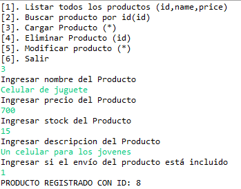
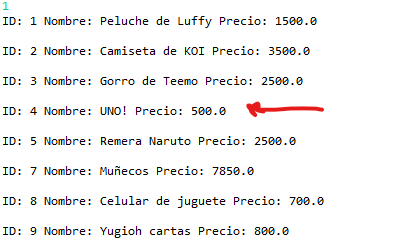

<!-- START doctoc generated TOC please keep comment here to allow auto update -->
<!-- DON'T EDIT THIS SECTION, INSTEAD RE-RUN doctoc TO UPDATE -->
**Table of Contents**  *generated with [DocToc](https://github.com/thlorenz/doctoc)*

- [Resolución Ejercicio 6a con explicación](#resoluci%C3%B3n-ejercicio-6a-con-explicaci%C3%B3n)
- [Incorporación del JConnector](#incorporaci%C3%B3n-del-jconnector)
- [Creación de base de datos](#creaci%C3%B3n-de-base-de-datos)
- [Creación de usuario](#creaci%C3%B3n-de-usuario)
- [División en capas](#divisi%C3%B3n-en-capas)
- [HashMap](#hashmap)
  - [Métodos utilizados para un HashMap](#m%C3%A9todos-utilizados-para-un-hashmap)
- [Capa Data - ProductoDAO](#capa-data---productodao)
- [Capa Lógica - ControladorCRUD](#capa-l%C3%B3gica---controladorcrud)
- [Capa UI - Menu](#capa-ui---menu)
- [Primera parte](#primera-parte)
  - [UI - mostrarTodosLosProductos()](#ui---mostrartodoslosproductos)
  - [Lógica - recuperarTodosLosProductos()](#l%C3%B3gica---recuperartodoslosproductos)
  - [Data - devolverTodosLosProductos()](#data---devolvertodoslosproductos)
  - [Test - Listar todos los productos](#test---listar-todos-los-productos)
- [Segunda parte](#segunda-parte)
  - [UI - mostrarProducto(c, lector)](#ui---mostrarproductoc-lector)
  - [Lógica - recuperarProducto(p)](#l%C3%B3gica---recuperarproductop)
  - [Data - devolverProducto(p)](#data---devolverproductop)
  - [Test - Buscar un producto por ID](#test---buscar-un-producto-por-id)
- [Tercera parte](#tercera-parte)
  - [UI - agregarProducto()](#ui---agregarproducto)
  - [Lógica - registrarProducto(p)](#l%C3%B3gica---registrarproductop)
  - [Data - insertarProducto(p)](#data---insertarproductop)
  - [Test - Insertar nuevo producto](#test---insertar-nuevo-producto)
- [Cuarta Parte](#cuarta-parte)
  - [UI - borrarProducto()](#ui---borrarproducto)
  - [Lógica - eliminarProducto(p)](#l%C3%B3gica---eliminarproductop)
  - [Data - destruirProducto(p)](#data---destruirproductop)
  - [Test - Borrar un producto por id](#test---borrar-un-producto-por-id)
- [Ultima parte](#ultima-parte)
  - [UI - modificarProducto()](#ui---modificarproducto)
  - [Lógica - modificarProducto()](#l%C3%B3gica---modificarproducto)
  - [Data - modificarDatosProducto()](#data---modificardatosproducto)
  - [Test - Modificar datos de un producto](#test---modificar-datos-de-un-producto)
- [Lo que aprendí](#lo-que-aprend%C3%AD)

<!-- END doctoc generated TOC please keep comment here to allow auto update -->

# Resolución Ejercicio 6a con explicación

**Ejercicio 6a**

Resolver:
1. Crear una clase Product que contenga los siguientes atributos: id:int, name:String, description:String, price:double, stock: int, shippingIncluded: boolean
2. Crear la base de datos javaMarket con la tabla Product para almacenar objetos de la clase Product con id autoincremental y los demás atributos según corresponda.
3. Cargar al menos 3 registros en la base de datos para realizar el desarrollo.

Crear una app que se conecte a la DB y permita:
1. list. Listar todos los productos indicando: id, name y price.
2. search. Mostrar los datos completos de un Product. El usuario debe ingresar un id y la app debe mostrar todos los datos de ese articulo.
3. new. Cargar nuevos Products (sin id) e insertarlos en la tabla. Durante la inserción debe recuperar el id generado en la BD y mostrarlo al usuario (no puede realizar un nuevo select)
4. delete. Eliminar un Product. El usuario debe ingresar un id y la app debe eliminar el registro
5. update. Modificar un Product. El usuario debe ingresar un id y la app debe mostrar los datos actuales y preguntar los nuevos datos. Finalmente debe aplicar el cambio en la base de datos.

Restricciones:
* Todo el manejo de la base de datos debe hacerse en una clase que no sea el programa principal ni la clase Product.
* La clase Product no puede contener código para leer o escribir datos de/a la interfaz, ni de o hacia la DB.
* Cada operación debe realizarse en un método (puede invocar a otros si desea reusar el código).
* Cada método solo puede recibir y/o devolver objetos Product o una colección (array, ArrayList, LinkedList, etc) de objetos Product. Por ejemplo el listar no necesita recibir nada y devuelve una colección de Product, el mostrar recibe un bbjeto Product con el id y devuelve uno completo.
* El archivo .jar del conector a la DB debe ubicarse localmente en el proyecto.

Sugerencias:
* No preocuparse por validaciones.
* Hacer un menu simple que itere y pregunte por las opciones requeridas (agregar una opción para salir)
* Primero cree la clase lógica, luego el menú sin realizar acciones y finalmente desarrollar las acciones una a una por el orden indicado, ya que se han listado en orden de dificultad.


# Incorporación del JConnector

Recordemos que tenemos que utilizar el JConnector proporcionado por mysql. Buscamos en la carpeta JConnector el .jar. Esta carpeta se encuentra el la ruta de instalación, en mi caso la default.

Creamos la carpeta lib en nuestro proyecto de Java, y le pegamos el .jar

Como es solo para escritorios o web -> click derecho add to path

# Creación de base de datos

Dejaré aquí el sql que realicé para crear la base de datos con su tabla producto ya cargada.

```sql
CREATE DATABASE  IF NOT EXISTS `javamarket`

USE `javamarket`;

DROP TABLE IF EXISTS `product`;
CREATE TABLE `product` (
  `product_id` int NOT NULL AUTO_INCREMENT,
  `product_name` varchar(60) NOT NULL,
  `product_description` varchar(255) NOT NULL,
  `product_price` double NOT NULL,
  `product_stock` int NOT NULL,
  `product_shipping_included` tinyint NOT NULL,
  PRIMARY KEY (`product_id`)
) ENGINE=InnoDB DEFAULT CHARSET=utf8mb3;
--
-- Dumping data for table `product`
--
INSERT INTO `product` VALUES 
(1,'Peluche de Luffy','Peluche 100% Algodón muy suave al tacto',1500,5,0),
(2,'Camiseta de KOI','Camiseta del equipo competitivo de e-sports KOI hecha de nylon',3500,10,1),
(3,'Gorro de Teemo','Gorro hecho de algodón del personaje Teemo de League of Legends',2500,15,1);
```

# Creación de usuario

Creamos un usuario en mySQL para que pueda acceder a la base de datos con los permisos de select, insert, update y delete

```sql
create user javamarketuser@'%' identified by 'laureano';
grant select, insert, update, delete on javamarket.* to javamarketuser@'%';
```

Para ver la información de todos tus usuarios creados desde una instancia root

```sql
SELECT * FROM mysql.user;
```

# División en capas

Tendremos 3 capas + el paquete de entidades.

En la capa de lógica tendremos al ControladorCRUD que manejará la lógica del negocio. En los primeros será más sencillo. Retornará un **Hashmap** para informar un mensaje de error y el objeto Producto respectivo (iterable o no).

En la capa de ui tendremos el menú principal con una instancia del controladorCRUD();

Desde aquí le pediremos que nos debe devolver mediante un menú.

Por ultimo tenemos la capa data, donde se encontrará el acceso a la base de datos y a la tabla Product para devolver los datos necesarios que le pida el controlador.


# HashMap

HashMap es una clase en Java que implementa la interfaz Map, que representa una colección de pares clave-valor, donde cada clave es única y se utiliza para acceder a su valor asociado. HashMap se basa en una tabla de dispersión (hash table) para implementar esta funcionalidad.

1. Las claves y los valores en un HashMap pueden ser de cualquier tipo de objeto, pero las claves deben ser únicas. 

2. HashMap no mantiene un orden específico de los elementos. Pero se puede implementar.

3. HashMap permite null como valor y también permite una sola clave null

4. HashMap proporciona un acceso rápido a los valores a través de las claves utilizando el concepto de hash code. Esto hace que las operaciones de búsqueda, inserción y eliminación sean eficientes en términos de tiempo promedio de ejecución, en promedio O(1) para la mayoría de las operaciones.

5. HashMap no es sincronizado, lo que significa que no es seguro para su uso en hilos de ejecución concurrentes. Si necesitas utilizar HashMap en un entorno multi-hilo, debes sincronizar su acceso manualmente o utilizar una implementación sincronizada, como Hashtable o ConcurrentHashMap.

*La notación Big O es una notación matemática que nos sirve para poner nota a la velocidad de procesamiento de un algoritmo atendiendo a cómo se comporta conforme aumenta el tamaño del trabajo a procesar, por lo que nos sirve para clasificar la eficacia de los mismos.*

Link: https://es.wikipedia.org/wiki/Complejidad_temporal

## Métodos utilizados para un HashMap

En un HashMap en Java, se pueden utilizar varios métodos para realizar operaciones de inserción, búsqueda, eliminación y otros manipulaciones de datos. Algunos de los métodos más comunes utilizados en un HashMap son los siguientes:

1. -> .put(K key, V value): Este método se utiliza para insertar un par clave-valor en el HashMap. Toma dos argumentos, la clave (key) y el valor (value) a ser insertados en el mapa.

2. -> .get(Object key): Este método se utiliza para obtener el valor asociado a una clave específica en el HashMap. Toma un argumento, la clave (key) para la cual se desea obtener el valor correspondiente, y devuelve el valor asociado a esa clave, o null si la clave no está presente en el mapa.

3. -> .remove(Object key): Este método se utiliza para eliminar un par clave-valor del HashMap basado en la clave proporcionada. Toma un argumento, la clave (key) del par clave-valor que se desea eliminar, y devuelve el valor asociado a esa clave antes de eliminarla, o null si la clave no está presente en el mapa.

4. -> .containsKey(Object key): Este método se utiliza para verificar si el HashMap contiene una clave específica. Toma un argumento, la clave (key) que se desea verificar, y devuelve true si la clave está presente en el mapa, o false en caso contrario.

5. -> .size(): Este método se utiliza para obtener el número de pares clave-valor en el HashMap. No toma argumentos y devuelve un entero que representa el número de elementos en el mapa.

6. -> .isEmpty(): Este método se utiliza para verificar si el HashMap está vacío, es decir, si no contiene ningún par clave-valor. No toma argumentos y devuelve true si el mapa está vacío, o false en caso contrario.

7. -> .clear(): Este método se utiliza para eliminar todos los pares clave-valor del HashMap, dejándolo vacío. No toma argumentos y no devuelve ningún valor.

# Capa Data - ProductoDAO

Crearemos esta clase llamada ProductoDAO para poder acceder a la base de datos.

En su constructor instanciaremos el Driver requerido del JConnector. Recordemos importar **java.sql.*** para poder utilizar los métodos correspondientes.

Ese constructor será llamado por el controlador que se encuentra en la capa de lógica, es decir, instanciaremos un ProductoDAO en el controlador.

Recordemos que el código del constructor es para crear un **conector**.

```java
package data;

import java.util.HashMap;
import java.util.LinkedList;
import java.util.Map;
import java.sql.*;

import entities.Producto;

public class ProductoDAO {

	public ProductoDAO() {

		try {
			Class.forName("com.mysql.cj.jdbc.Driver").newInstance();
		} catch (InstantiationException | IllegalAccessException | ClassNotFoundException e) {
			e.printStackTrace();
		}
	}
}
```

# Capa Lógica - ControladorCRUD

En la capa lógica tendremos a nuestro ControladorCRUD, con una instancia del controlador. Vemos como lo instancia y como consecuencia se crea el conector (JConnector).

```java
package logic;

import java.util.HashMap;
import java.util.Map;

import data.ProductoDAO;
import entities.Producto;

public class ControladorCRUD {

	private static ProductoDAO pdao = new ProductoDAO();

    //Métodos de manejo del negocio

}
```

# Capa UI - Menu

Pues en la capa de presentación este no se si estará bien pero se me ocurre que debe tener instanciado un controladorCRUD.

Y en su método main se encontrará el menú.

En cada opción se realizará algo.

El primer item del ejercicio es mostrar todos los productos con su id, nombre y precio.

Asi que llamaremos ese método si el usuario introduce el número 1.

```java
package ui;

import java.util.LinkedList;
import java.util.Map;
import java.util.Scanner;

import entities.Producto;
import logic.ControladorCRUD;

public class Menu {

	static ControladorCRUD c = new ControladorCRUD();
	
	public static void main(String[] args) {
	
		Scanner lector = new Scanner(System.in);

		String op = "";
		while (!op.equals("6")) {

			System.out.println(
					"[1]. Listar todos los productos (id,name,price)\n[2]. Buscar producto por id(id)\n[3]. Cargar Producto (*)\n[4]. Eliminar Producto (id)\n[5]. Modificar producto (*)\n[6]. Salir");
			op = lector.nextLine();

			switch (op) {

			case "1": mostrarTodosLosProductos(c);
				break;

			case "2":
				break;

			case "3":
				break;

			case "4":
				break;

			case "5":
				break;

			}
		}

		System.out.println("Fin");
	}
}
```
# Primera parte

En la primera parte era listar todos los productos indicando: id, name y price.


## UI - mostrarTodosLosProductos()

En este método de la clase Menú nos estaremos esperando el resultado del controlador que se le pide que se ejecute el metodo devolverTodosLosProductos();

Este método al ser un HashMap tendrá <String, Object> ¿Por qué?

He decidido utilizar esta estructura de datos porque el controlador le va a devolver a la UI si hubo algún error en el camino del manejo del negocio.

Por lo que podría devolver un String o un Producto (iterable o no)

En Java **solo se puede retornar un objeto** por lo que devolver un hashmap es conveniente para esta situación.

> Cada mapa tendrá dos combos de clave-valor, serán en este caso ("productos",productos) y ("error", mensaje) se verá explicitamente mejor en la capa de acceso a datos.

En este método preguntamos si en el mapa hay o no un mensaje de error.

Si el mensaje de error No es null lo mostramos por consola.
Si el mensaje de error es null proseguimos a crear una LinkedList llamada productos a la cual le asignaremos el puntero que se encuentre en el mapa apuntando al iterable en memoria.

Luego definimos una variable local vacía llamada listado para luego iterar sobre la LinkedList productos e ir sumando al listado lo solicitado por el usuario: "id, nombre y precio"

Para cada producto le decimos que nos devuelvan los valores correspondientes y lo agregamos al listado.

Finalmente, una vez terminada la iteración, mostramos el listado por consola.

```java
private static void mostrarTodosLosProductos(ControladorCRUD c) {
		
		Map<String,Object> map = c.recuperarTodosLosProductos();
		
		if(map.get("error") != null) {
   			System.out.println(map.get("error"));
   		}
   		else {
   			
   			// casteo para que sea linkedlist ya que el map decia STRING, OBJECT
   		
   			LinkedList<Producto> productos = (LinkedList<Producto>) map.get("productos");
   		
   			String listado = "";
   			
   			for(Producto producto : productos){
   				
   				listado += "ID: " + producto.getId() + " Nombre: " + producto.getName() + " Precio: " + producto.getPrice() + "\n\n";
   			}
   				
   			System.out.println(listado);
   		}	
		
}

```

## Lógica - recuperarTodosLosProductos()

En nuestro ControladorCRUD definiremos un método llamado recuperarTodosLosProductos.

Lo que hará será pedirle a nuestro DAO que busque y retorne todos los productos con sus id, nombres y precios.

En el caso de un error, devuelve un mensaje.

Utilizamos una estructura de Map también.

Simple

```java
public static Map<String, Object> recuperarTodosLosProductos() {

		Map<String, Object> mapa = pdao.devolverTodosLosProductos();
		return mapa;
	}
```

## Data - devolverTodosLosProductos()

Explicaremos paso a paso como funciona este método.

Primero este método está definido para devolver un tipo de objeto Map.

Primero instanciamos un nuevo Map y le asignamos un HashMap vacío.
Luego creamos una lista enlazada vacía para ir agregando todos los productos.

Connection conn = null; -> la variable conn es un Objeto Connection y le asignamos null para decir que la conexión está cerrada. Es una preparación.

Abrimos un bloque try catch, utilizamos este manejo de excepciones por si ocurre un error con la base de datos por ejemplo que se encuentre detenido el servicio mysql por lo tanto nunca se conectará y nos tirará una excepeción.

Try (intentaremos) ->

1. Abrir una conexión con el DriverManager.getConnection(Connection String);

El Connection String tendrá la info necesaria para acceder a la base de datos tal como el host, usuario y contraseña.

Una vez abierta la conexión luego habrá que cerrarla porque sino ocupará espacio en memoria. Y si suponemos que hay muchas conexiones abiertas y nunca se cierran los recursos se agotan.

Seguimos.

Luego de abrir la conexión crearemos la query o statement para luego ejecutarla y obtener el resultado en estructura de datos ResultSet.

Vemos como el parametro del statetment executeQuery(query) se encuentra la sentencia SQL que le pediremos a la base de datos. Una que el Statement ejecuta la query, devuelve un ResultSet. Por eso creamos un Objeto ResultSet en la variable rs el cual es asignado el retorno de la query.

Ahora nos toca el ***mapeo de ResultSet a Objeto Java**, en nuestro caso a una entidad, el objeto Producto.

Para ello utilizamos un bucle while() donde iterará hasta que se quede sin registros.

Si la query da ningun registro como resultado, retorna algo default (recuerdo que me habia retornado 0 0 0 0 0 0 por decir algo), por lo que habría que realizar un manejo de ello y ademas ver si está bien escrita.

Entonces el objetivo de esta iteración es que por cada registro, agrego un objeto persona al iterable creado previamente para luego agregarlo al map.

Primera iteración:
Creo un nuevo objeto Producto para luego setearle los atributos.

A nuestra instancia **p** le seteamos lo pedido: id, nombre y precio.

Hay que pedirle al ResultSet devuelto, es decir, lo que quedó guardado en **rs** que nos devuelva si es Int, String, (tipo de dato que sea) y luego como parámetro poner la columna.

Es decir si quiero el id pongo **rs.getInt("product_id")**
Y como devuelve el id, lo pongo como parámetro al setter correspondiente.

Luego de realizar todo el mapeo, se agrega el producto al iterable productos

Lo mismo con las demas iteraciones.

Una vez termina las iteraciones del ciclo while() vamos a cerrar en orden las conexiones.

Si no están cerradas: Cierro el ResultSet, luego cierro el Statement (query) y por ultimo cierro la conexión que abrimos al inicio del método.

Ahora si podemos agregar la lista enlazada al mapa -> "productos",productos

Si no ocurrió ninguna excepción hasta este punto también será agregado en el hashmap el combo "error", null

Y ya sale del try por lo que retornará el mapa con la lista enlazada asignada. En caso de que haya habido alguna excepción, en el mapa se agregará la información de la excepción en un mensaje

"error",mensaje
"productos",null

```java
public Map<String, Object> devolverTodosLosProductos() {

	Map<String, Object> mapa = new HashMap();
	LinkedList<Producto> productos = new LinkedList<Producto>();

	Connection conn = null;
	try {

		// abrir conexión
		conn = DriverManager.getConnection("jdbc:mysql://localhost/javamarket", "javamarketuser", "laureano");

		// creo statement
		Statement st = conn.createStatement();
		ResultSet rs = st.executeQuery("select product_id, product_name, product_price from product");

		// mapeo resultset a objeto java y agrego a productos

		while (rs.next()) {
				Producto p = new Producto();

				p.setId(rs.getInt("product_id"));
				p.setName(rs.getString("product_name"));
				p.setPrice(rs.getDouble("product_price"));

				productos.add(p);
			}

			// cerrar conexión

		if (rs != null) {
				rs.close();
			}
		if (st != null) {
				st.close();
			}

		conn.close();

		mapa.put("productos", productos);
		mapa.put("error", null);

	} 
    
    catch (SQLException ex) {
			String mensaje = "SQLException: " + ex.getMessage() + " SQLState: " + ex.getSQLState() + "VendorError: "
					+ ex.getErrorCode();
			mapa.put("error", mensaje);
			mapa.put("producto", null);
		}

		return mapa;

}

```

## Test - Listar todos los productos

Bueno ahora es hora de probar si funciona nuestro primer apartado del menú.

Para ello primero le damos play y nos mostrará el camino feliz.

<image src="img/ejercicio_06/ej06_mostrarTodosLosProductos.png" alt="Resultado del metodo">

En caso de querer el camino triste, el de la excepción, detendremos el servicio mysql.

En windows -> Tecla windows, escribimos servicios, buscamos mysql, click derecho detener.

Luego recordemos de reanudar el servicio. (Iniciar)

<image src="img/ejercicio_06/mysql_stop.png" alt="Resultado del metodo">

En el camino triste obtenemos el siguiente resultado.

<image src="img/ejercicio_06/ej06_mostrarTodosLosProductosTriste.png" alt="Resultado del metodo">

# Segunda parte

La segunda parte era mostrar los datos completos de un Product. El usuario debe ingresar un id y la app debe mostrar todos los datos de ese articulo.

## UI - mostrarProducto(c, lector)

En nuestro menú nos queda así

```java
case "2": mostrarProducto(c, lector);
				break;
```

El ejercicio nos especifica que no pasemos parametros primitivos porque el día de mañana si cambia tambien tenemos que cambiar el llamado al metodo.

Si pasamos Producto() no tendremos que cambiar el llamado al método. En **JDBC_02.md** se explica mejor.

Por lo que pediremos que ingrese un id, luego creamos un objeto persona y le seteamos el id.

Creamos un Map<String, Object> map que se le asignará el retorno del mensaje al controlador recuperarProducto(p) y le pasamos el parámetro Producto p

Como nos va a devolver el hashmap.

El error no se encuentra nulo? Mostralo
Si se encuentra nulo, en Producto le asigno lo que se encuentre en el hashmap con la clave "producto"

Luego imprimo el producto.

```java
private static void mostrarProducto(ControladorCRUD c, Scanner lector) {
		
	System.out.println("Ingrese un ID de Producto");
	int id = Integer.parseInt(lector.nextLine());
		 
	Producto p = new Producto();
	p.setId(id);
		 
	Map <String, Object> map = c.recuperarProducto(p);
		 
	if(map.get("error") != null) {
			 System.out.println(map.get("error"));
	}
	else {
		    Producto producto = (Producto) map.get("producto");
			 System.out.println("ID: " + producto.getId() + " Nombre: " + producto.getName() +" Stock: " + producto.getStock() + " Precio: " + producto.getPrice() + " Descripcion: " + producto.getDescription() + " Envío: " + producto.isShippingIncluded());
		 }
}
```

## Lógica - recuperarProducto(p)

Como no hay mucha lógica de negocio es simple, es pedirle al dao que nos traiga un hashmap conteniendo un producto y un mensaje de error. Como se lo pedimos? Diciendole al dao que utilice el metodo devolverProducto(p).

Nuevamente le pasamos el Producto como párametro, aquél que ya tiene el id seteado.

```java
public Map<String, Object> recuperarProducto(Producto p) {
		
	Map<String, Object> mapa = pdao.devolverProducto(p);
	return mapa;
}
```

## Data - devolverProducto(p)

Ahora tenemos un parámetro!

Utilizaremos un PreparedStatement para introducir facilmente el parámetro. En este caso no es necesario que sea de ese tipo de objeto, podría ser tranquilamente Statement porque el parámetro es un entero y **no permite caracteres especiales**. Pero por comodidad utilizaré un PreparedStatement.

1.Inicializamos conn como un objeto Connection en null.
2. Creamos un hashmap vacío.
3. Abrimos conexión
4. Preparamos la query
5. Definimos los parárametros
6. Ejecutamos la query y guardamos el resultset.
7. Mapeamos el ResultSet a objeto Java
8. Agregamos el producto al mapa.
9. Agregamos el error como null.

En caso de excepción

1. Asignamos mensaje de error
2. Agregamos el error y su mensaje
3. Agregamos el producto, null

**Cualquiera de los dos caminos retornamos un map.**

```java
public Map<String, Object>devolverProducto(Producto p){
		
	Connection conn = null;
	Map<String,Object> mapa = new HashMap();
		
	try {
		//abro conexión
		conn = DriverManager.getConnection("jdbc:mysql://localhost/javamarket","javamarketuser","laureano");
			
		//preparo la query
		PreparedStatement st = conn.prepareStatement("select * from product where product_id=?");
			
		//defino los parametros
		st.setInt(1,p.getId());
			
		//ejecuto y guardo resultado
		ResultSet rs = st.executeQuery();
			
		// puedo utilizar if porque es solo 1, con while da igual
		if(rs.next()) {
	
			p.setName(rs.getString("product_name"));
			p.setDescription(rs.getString("product_description"));
			p.setPrice(rs.getDouble("product_price"));
			p.setStock(rs.getInt("product_stock"));
			p.setShippingIncluded(rs.getBoolean("product_shipping_included"));
		}
			
		mapa.put("producto", p);
		mapa.put("error", null);
			
		}
		catch(SQLException ex) {
			String mensaje = "SQLException: " + ex.getMessage() + "SQLState: " + ex.getSQLState() + "VendorError: "
					+ ex.getErrorCode();
			mapa.put("error", mensaje);
			mapa.put("producto", null);
		}
		
	return mapa;
		
}
```

## Test - Buscar un producto por ID

Probamos camino feliz y triste

1. Sin problemas 


2. Con problemas porque el id no existe en la base de datos y el retorno da algo por default. Hay que manejarlo


3. Si desconectamos mysql obtendremos el respectivo mensaje de error.

# Tercera parte

La tercera parte era cargar nuevos Products (sin id) e insertarlos en la tabla. Durante la inserción debe recuperar el id generado en la BD y mostrarlo al usuario (no puede realizar un nuevo select)

## UI - agregarProducto()

Aquí pediremos todos los datos necesarios seteandole los atributos a un objeto Producto.

Luego le pedimos al controlador que registre el producto creado. Y devolverá el producto o mensaje de error para luego mostrarlo por pantalla.

```java
private static void ingresarProducto(ControladorCRUD c, Scanner lector) {
		
		Producto p = new Producto();
		
		System.out.println("Ingresar nombre del Producto");
		p.setName(lector.nextLine());
		
		System.out.println("Ingresar precio del Producto");
		p.setPrice(Double.parseDouble(lector.nextLine()));
		
		System.out.println("Ingresar stock del Producto");
		p.setStock(Integer.parseInt(lector.nextLine()));
		
		System.out.println("Ingresar descripcion del Producto");
		p.setDescription(lector.nextLine());
		
		System.out.println("Ingresar si el envío del producto está incluido");
		p.setShippingIncluded(Boolean.parseBoolean(lector.nextLine()));
		
		Map<String,Object> mapa = c.registrarProducto(p);
		
		if (mapa.get("error") != null) {
			System.out.println(mapa.get("error"));
		} else {
			Producto producto = (Producto) mapa.get("producto");
			
			System.out.println("PRODUCTO REGISTRADO CON ID: " + producto.getId());
		}
		

	}
```
## Lógica - registrarProducto(p)

Misma idea que los dos metodos del controlador anteriores.

Pedirle al dao que nos inserte el producto.

```java
public Map<String, Object> registrarProducto(Producto p){
	Map<String, Object> mapa = pdao.insertarProducto(p);
	return mapa;
}
```

## Data - insertarProducto(p)

Al inicio es la misma idea. Sin embargo en el momento de declarar el statement debemos poner un parámetro extra para luego pedir las clave primaria generada automaticamente.

Definimos los parámetros a utilizar en el insert.

Esta vez ejecutamos la query con .executeUpdate() que no retorna nada.

Creamos un ResultSet y pedimos la clave primaria generada del statement

Libero los recursos y agrego al mapa.

El catch es lo mismo.

```java
public Map<String, Object> insertarProducto(Producto p) {

		Connection conn = null;
		Map<String, Object> mapa = new HashMap();

		try {
			// abro conexión
			conn = DriverManager.getConnection("jdbc:mysql://localhost/javamarket", "javamarketuser", "laureano");

			// Preparo la Statement con su PreparedStatement.RETURN_GENERATED_KEYS
			// La clave primaria es autogenerada por la base de datos
			PreparedStatement st = conn.prepareStatement(
					"insert into product(product_name, product_price, product_stock, product_description, product_shipping_included) values (?,?,?,?,?)",
					PreparedStatement.RETURN_GENERATED_KEYS);

			// Defino lo parámetros requeridos en la query
			st.setString(1, p.getName());
			st.setDouble(2, p.getPrice());
			st.setInt(3, p.getStock());
			st.setString(4, p.getDescription());
			st.setBoolean(5, p.isShippingIncluded());

			// Ejecuto la modificación de tablas
			st.executeUpdate();

			// Ahora busco la clave primaria generada

			ResultSet rskey = st.getGeneratedKeys();

			// Si se encuentra algo en la primera posición entrá
			if (rskey.next()) {
				// Asigno el id generado
				p.setId(rskey.getInt(1));
			}

			// Libero los recursos

			if (rskey != null) {
				rskey.close();
			}
			if (st != null) {
				st.close();
			}

			conn.close();
			
			// Agrego el producto al map
			
			mapa.put("producto", p);
			mapa.put("error", null);

		} catch (SQLException ex) {
			String mensaje = "SQLException: " + ex.getMessage() + "SQLState: " + ex.getSQLState() + "VendorError: "
					+ ex.getErrorCode();
			mapa.put("error", mensaje);
			mapa.put("producto", null);
		}

		return mapa;

	}
```

## Test - Insertar nuevo producto

Pues he ido insertando nuevos productos y he comprobado que funciona utilizando los métodos anteriores.

Probando nuevo método



Comprobando con la primera parte


Comproband con la segunda parte


# Cuarta Parte
La cuarta parte decía eliminar un Product. El usuario debe ingresar un id y la app debe eliminar el registro.

## UI - borrarProducto()

Iré más rápido pues es una mezcla de la segunda y tercera parte.

```java
private static void borrarProducto(ControladorCRUD c, Scanner lector) {

		System.out.println("Ingrese un ID de Producto");
		int id = Integer.parseInt(lector.nextLine());

		Producto p = new Producto();
		p.setId(id);

		Map<String, Object> map = c.eliminarProducto(p);

		if (map.get("error") != null) {
			System.out.println(map.get("error"));
		} else {
			Producto producto = (Producto) map.get("producto");
			System.out.println("PRODUCTO ELIMINADO CON ID: " + producto.getId());
		}
	}

```

## Lógica - eliminarProducto(p)

Simple

```java
public Map<String, Object> eliminarProducto(Producto p){
		Map<String, Object> mapa = pdao.destruirProducto(p);
		return mapa;
	}
```

## Data - destruirProducto(p)

Aquí existe una combinación, utilizamos el metodo .executeUpdate() solo para que realice la query del delete from where.

```java
public Map<String, Object> destruirProducto(Producto p) {

		Connection conn = null;
		Map<String, Object> mapa = new HashMap();

		try {
			
			conn = DriverManager.getConnection("jdbc:mysql://localhost/javamarket", "javamarketuser", "laureano");

			PreparedStatement st = conn.prepareStatement("delete from product where product_id=? ");
			
			st.setInt(1, p.getId());
			
			st.executeUpdate();

			mapa.put("producto", p);
			mapa.put("error", null);

		} catch (SQLException ex) {
			String mensaje = "SQLException: " + ex.getMessage() + "SQLState: " + ex.getSQLState() + "VendorError: "
					+ ex.getErrorCode();
			mapa.put("error", mensaje);
			mapa.put("producto", null);
		}

		return mapa;

}
```

## Test - Borrar un producto por id

Probando el código funciona bien, elimina fisicamente el registro con un id igual.

Existe un problema en este código y es que no valida si la cantidad de tablas que fueron modificadas fue 0. Por ejemplo si ponemos un id no existente en la base de datos no pasará nada, pero yo puse que informe el id del producto eliminado, por lo que mostrará el mensaje que ha eliminado el producto de todas formas. Habría que hacer un if y rellenar el mensaje. Luego se mostraría el mensaje correspondiente.

Aquí una demostración


Aquí vemos como funciona correctamente el borrado físico.


# Ultima parte

Modificar un Product. El usuario debe ingresar un id y la app debe mostrar los datos actuales y preguntar los nuevos datos. Finalmente debe aplicar el cambio en la base de datos.

## UI - modificarProducto()

Será una mezcla de la segunda parte y tercera parte.
De seguro se puede optimizar.

Creamos un método cambiarDatosProducto
```java
case "5": cambiarDatosProducto(c,lector);
				break;
```
Pido ID, utilizo el método de la segunda parte. 
Recupero el map, si el mensaje no está nulo prosigo a mostrarle la info y pedir los datos para luego decirle a controlador che quiero que me modifiques el producto.

Si sale todo bien te muestro el producto con los nuevos datos modificados.

```java
private static void cambiarDatosProducto(ControladorCRUD c, Scanner lector) {

		System.out.println("Ingrese un ID de Producto para modificar");
		int id = Integer.parseInt(lector.nextLine());

		Producto p = new Producto();
		p.setId(id);

		Map<String, Object> map = c.recuperarProducto(p);

		if (map.get("error") != null) {
			System.out.println(map.get("error"));
		} else {
			Producto producto = (Producto) map.get("producto");
			System.out.println(" Producto -> ID: " + producto.getId() + " Nombre: " + producto.getName() + " Stock: "
					+ producto.getStock() + " Precio: " + producto.getPrice() + " Descripcion: "
					+ producto.getDescription() + " Envío: " + producto.isShippingIncluded());
			
			System.out.println("Ingresar nuevo nombre del Producto");
			p.setName(lector.nextLine());
			
			System.out.println("Ingresar nuevo precio del Producto");
			p.setPrice(Double.parseDouble(lector.nextLine()));
			
			System.out.println("Ingresar nuevo stock del Producto");
			p.setStock(Integer.parseInt(lector.nextLine()));
			
			System.out.println("Ingresar nueva descripcion del Producto");
			p.setDescription(lector.nextLine());
			
			System.out.println("Ingresar si el envío del producto está incluido");
			p.setShippingIncluded(Boolean.parseBoolean(lector.nextLine()));
			
			
			map = c.modificarProducto(producto);
			if (map.get("error") != null) {
				System.out.println(map.get("error"));
			} else {
				producto = (Producto) map.get("producto");
				System.out.println("Producto Modificado");
				System.out.println("ID: " + producto.getId() + " Nombre: " + producto.getName() + " Stock: "
						+ producto.getStock() + " Precio: " + producto.getPrice() + " Descripcion: "
						+ producto.getDescription() + " Envío: " + producto.isShippingIncluded());
			}
		
		}
		
		
}
```

## Lógica - modificarProducto()

Misma idea que los 4 anteriores. Pedirle al dao, que es el encargado al acceso a los datos, che quiero modificar el producto que contiene ese id con esos nuevos datos.

```java
public Map<String, Object> modificarProducto(Producto p) {
	Map<String, Object> mapa =  pdao.modificarDatosProducto(p); 
	return mapa;
	}
```

## Data - modificarDatosProducto()

Si leistes las anteriores partes, los pasos son muy parecidos, lo que cambia es la sentencia de la query y que no guardo ningun resultset.

Retorno el mapa ya sea con error nulo o no.

```java
public Map<String, Object> modificarDatosProducto(Producto p) {

		Connection conn = null;
		Map<String, Object> mapa = new HashMap();

		try {

			conn = DriverManager.getConnection("jdbc:mysql://localhost/javamarket", "javamarketuser", "laureano");

			PreparedStatement st = conn.prepareStatement("update product set product_name=?, product_price=?, product_stock=?, product_description=?, product_shipping_included=? where product_id=? ");
			st.setString(1, p.getName());
			st.setDouble(2, p.getPrice());
			st.setInt(3, p.getStock());
			st.setString(4, p.getDescription());
			st.setBoolean(5, p.isShippingIncluded());
			st.setInt(6, p.getId());

			st.executeUpdate();

			if (st != null) {
				st.close();
			}

			conn.close();

			mapa.put("producto", p);
			mapa.put("error", null);

		} catch (SQLException ex) {
			String mensaje = "SQLException: " + ex.getMessage() + "SQLState: " + ex.getSQLState() + "VendorError: "
					+ ex.getErrorCode();
			mapa.put("error", mensaje);
			mapa.put("producto", null);
		}

		return mapa;

	}

```
## Test - Modificar datos de un producto

Pues utilizamos el metodo desarrollado en la primera parte para ver todos los productos disponibles y elegir uno desde ahí.

Seguramente ocurrirá el problema planteado anteriormente de si no existe el id.

Pedimos todos los productos con la opción 1


Luego con la opción 5 nos pide ingresar un id, nos muestra la información del producto e ingresamos los nuevos datos del producto.


Por si no te quedaste convencido de que funcionó utilizaremos la primera opción para recuperar todos los productos y veremos que se encuentra allí.



# Lo que aprendí

Un ejercicio completo para entender los conceptos de 3 capas. En un principio me desvié por las ramas por no leer completamente el ejercicio con sus restricciones. Había mezclado las tres capas por completo pero me di cuenta y comencé a realizarlo de nuevo.

Este ejercicio me sirvió para comprender mejor como se programa en tres capas. Aún no está 'corregido' asi que estaré esperando a ver que puedo mejorar y si entendí el concepto.

La UI solo le pedía al controlador que le traiga lo que quisiera para luego presentarlo en pantalla.

El controlador no tuvo un trabajo muy complicado ya que solo debía pedirle al DAO de Producto la acción que correspondía. La consulta sql eran simples y hacia una sola tabla. Si no se sabe mucho de sql quizá podrías traer el conjunto de objetos y trabajar con ese iterable hasta tener el resultado deseado para devolverselo a la ui.

La capa de data para conectarse a la base de datos, recuperar, insertar, eliminar o modiciar (CRUD).

Con la capa de data se aprendió mucho a crear el conector, abrir conexión, preparar la query y ejecutar la query. Que devuelve un tipo de objeto Resultset para luego mapearlo a objeto.

También aprendí más sobre una nueva estructura de datos a la que di mucho uso -> HashMap.

Por ultimo y no menos importante aprendí la configuración previa que hay que tener para este ejercicio como el JConnector de mysql para poder realizar las conexiones con la base de datos desde Java y obviamente importar java.mysql para obtener los métodos necesarios para ejecutar una query.


